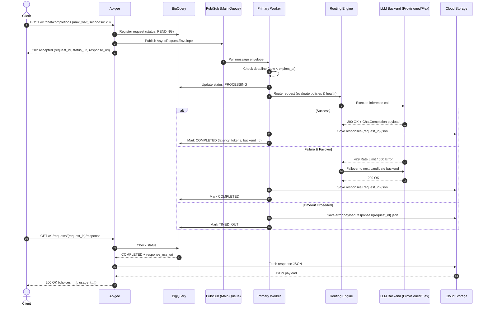
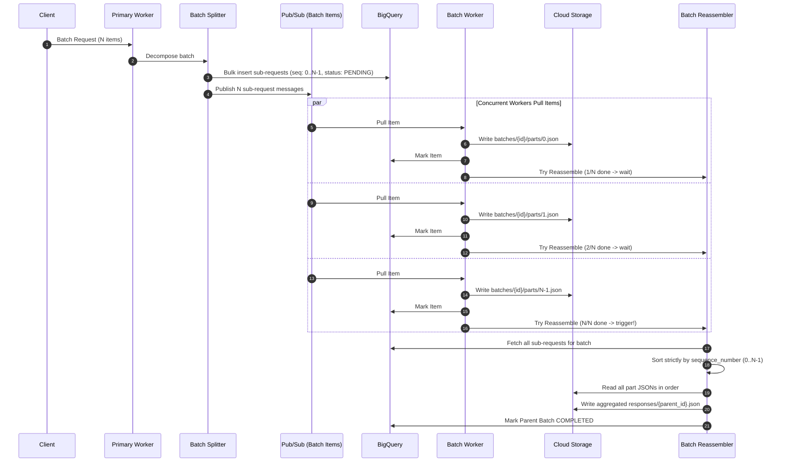

# Asynchronous LLM Gateway - Architecture Specification

## 1. Overview

The **Asynchronous LLM Gateway** is an enterprise-grade service designed to handle OpenAI-compatible LLM inference requests asynchronously on Google Cloud Platform. It optimizes inference costs by leveraging **GCP Provisioned Throughput** (Vertex AI Gemini) during surplus/off-peak capacity, while providing intelligent fallback to **Gemini Flex** (pay-as-you-go) and third-party LLM providers (e.g., OpenAI).

The system seamlessly accommodates both **single online requests** and **bulk batch requests**, automatically decomposing bulk batches into parallel sub-requests when targeting backends without native batch processing capabilities, and reassembling them in strict sequential order.

---

## 2. High-Level Architecture Diagram

```mermaid
graph TD
    Client["Client / User Application"]
    Apigee["GCP Apigee API Gateway<br/>(Auth, Validation, Quotas)"]
    
    subgraph Queuing ["GCP Pub/Sub Queuing Layer"]
        TopicMain["Topic: asyncgw-requests-topic<br/>(Single & Full Batch Envelopes)"]
        TopicBatchItems["Topic: asyncgw-batch-items-topic<br/>(Decomposed Sub-Requests)"]
        TopicDLQ["Topic: asyncgw-dlq-topic<br/>(Dead Letter Queue)"]
    end
    
    subgraph Workers ["Cloud Run Worker Fleet"]
        PrimaryWorker["Primary Request Worker<br/>(Cloud Run Service / Job)"]
        BatchSplitter["Batch Splitter Component"]
        BatchWorker["Batch Sub-Request Worker<br/>(Cloud Run Service / Job)"]
        Reassembler["Batch Reassembler Component"]
        RouterEngine["Policy Routing & Failover Engine"]
    end

    subgraph Backends ["LLM Inference Backends"]
        Provisioned["GCP Provisioned Throughput<br/>(Vertex AI Gemini)"]
        Flex["Gemini FLEX<br/>(On-demand Pay-as-you-go)"]
        OpenAI["OpenAI Direct API"]
        Mock["Mock / Internal Backends"]
    end

    subgraph Persistence ["Persistence & Analytics"]
        BigQuery["Google Cloud BigQuery<br/>(Date-Partitioned Request Tracker)"]
        GCS["Google Cloud Storage<br/>(7-Day Auto-Delete Retention Bucket)"]
    end

    Client -->|HTTP 202 Async Submission| Apigee
    Apigee --> TopicMain
    Apigee -->|Initial PENDING Entry| BigQuery
    
    TopicMain --> PrimaryWorker
    PrimaryWorker -->|Check Expiration & Route| RouterEngine
    
    PrimaryWorker -->|Native Batch or Single| RouterEngine
    RouterEngine --> Provisioned
    RouterEngine --> Flex
    RouterEngine --> OpenAI
    RouterEngine --> Mock

    PrimaryWorker -->|Decompose Batch| BatchSplitter
    BatchSplitter -->|Indexed Sub-Envelopes| TopicBatchItems
    BatchSplitter -->|Sub-Request PENDING Rows| BigQuery
    
    TopicBatchItems --> BatchWorker
    BatchWorker -->|Execute Sub-Query| RouterEngine
    BatchWorker -->|Save Partial Part JSON| GCS
    BatchWorker -->|Mark Sub-Query Status| BigQuery
    BatchWorker --> Reassembler

    Reassembler -->|Check All Items Finished| BigQuery
    Reassembler -->|Read & Reassemble in Seq Order| GCS
    Reassembler -->|Write Final Aggregated JSON| GCS
    Reassembler -->|Mark Parent Batch COMPLETED| BigQuery

    PrimaryWorker -->|Save Single Response JSON| GCS
    PrimaryWorker -->|Mark Single COMPLETED| BigQuery

    Client -.->|"Poll Status GET /v1/requests/{id}"| Apigee
    Apigee -.-> BigQuery
    Client -.->|"Fetch Response GET /v1/requests/{id}/response"| Apigee
    Apigee -.-> GCS
```

---

## 3. Key Flows

### 3.1. Single Online Request Execution Flow

---

### 3.2. Batch Decomposing and Ordered Reassembly Flow

When a batch request is routed to a backend that only supports individual requests (such as Vertex Gemini Flex or on-demand models):

---

## 4. BigQuery Partitioned Tracking Data Model

The `asyncgw_metrics.request_tracker` table is partitioned by `DATE(created_at)` and clustered on `status`, `request_id`, and `parent_request_id`.

| Column Name | Type | Mode | Description |
| :--- | :--- | :--- | :--- |
| `request_id` | STRING | REQUIRED | Unique identifier for request or sub-query |
| `parent_request_id` | STRING | NULLABLE | Parent batch ID if decomposed |
| `sequence_number` | INT64 | NULLABLE | 0-indexed position within batch |
| `total_items` | INT64 | NULLABLE | Total items in parent batch |
| `custom_id` | STRING | NULLABLE | User-provided custom ID per item |
| `request_type` | STRING | REQUIRED | `chat.completion`, `text.completion`, `embeddings`, `batch` |
| `status` | STRING | REQUIRED | `PENDING`, `PROCESSING`, `COMPLETED`, `FAILED`, `TIMED_OUT` |
| `model` | STRING | NULLABLE | LLM Model requested |
| `max_wait_seconds` | INT64 | NULLABLE | User deadline in seconds |
| `created_at` | TIMESTAMP | REQUIRED | Submission timestamp (Partition Key) |
| `expires_at` | TIMESTAMP | NULLABLE | Calculated expiration timestamp |
| `started_at` | TIMESTAMP | NULLABLE | Worker pickup timestamp |
| `completed_at` | TIMESTAMP | NULLABLE | Completion timestamp |
| `elapsed_seconds` | FLOAT64 | NULLABLE | End-to-end execution latency |
| `backend_service_id` | STRING | NULLABLE | Backend used (e.g. `gcp-provisioned-gemini`) |
| `backend_endpoint` | STRING | NULLABLE | Target API endpoint URL |
| `response_status_code`| INT64 | NULLABLE | Response HTTP code |
| `response_content_length`| INT64 | NULLABLE | Response size in bytes |
| `response_gcs_uri` | STRING | NULLABLE | `gs://...` URI to result JSON in GCS |
| `error_message` | STRING | NULLABLE | Error message if failed or timed out |
| `retry_count` | INT64 | NULLABLE | Number of failover / retry attempts |
| `content_tokens` | INT64 | NULLABLE | Total token count |
| `metadata_json` | STRING | NULLABLE | Client tags and custom metadata |

---

## 5. Storage Lifecycle and Retention

- **GCS Bucket**: `asyncgw-responses-<project-id>`
- **Retention**: Lifecycle policy configured for **7 days** automatic deletion.
- **Directory Layout**:
  - `responses/{request_id}.json` (Single completions and final aggregated batch outputs)
  - `batches/{parent_request_id}/parts/{sequence_number}.json` (Intermediate partial chunks)
